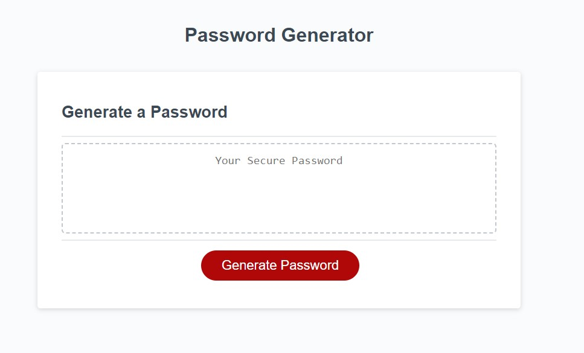

# Password-generator

## Password generator with customizable choices

Link to live application: https://misterbham.github.io/password-generator/

This is a password generator application that can provide a randomized password based on your preferential choices. From a programming perspective, this application highlights some of the more core fundamental pieces of code, such as eventlisteners and loops.

I made this to actively practice the language, get accustomed to using JavaScript syntax to create applications that serve a real-world purpose.

In the creation of this, I've learned a great deal specifically around while loops, and how to not make endless loops. This was also my first attempt at proper error handling, such as ensuring that the input question of "How long should your password be" is returned with a number.
